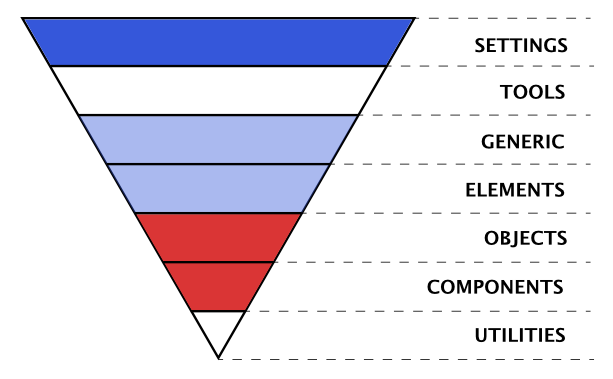

# CSS from Good to Ugly to Good again

We're looking at a way to use CSS-the-good-bits in harmony with CSS-in-JS for a
pain-free and flexible styling solution.

I am using a "mental model" as a framework to make these decisions. The hope is
that, by the end, the mental model will be another tool in your toolbox! In the
end this is just a bunch of observations that I hope will enliven thought.

At its most essential, the mental model I have made emphasizes **recognizing
boundaries and the consequent consequences of crossing those boundaries**.

1. The simple observation is that we always pay some cost when we cross a
   boundary. For example, even if we are crossing between 2 identical fields, we
   either have to climb a fence (there is a cost in exertion and speed), or if
   someone has put a gate in the fence, the cost to us is less (we still are
   slowed and cannot choose where to cross) but the bulk of the cost is
   abstracted by the fence builder (a gate is more complex and costs more). In
   reality boundary changes are seldom between like and like but from one kind
   of environment to a another; land to sea, earth to space, CSS to JS...
2. The second observation is that some boundaries cost more to cross than
   others.
3. The third is that some boundaries are crossed because we need to - due to
   central values or requirements - and some because we never really considered
   it. For example, most of the decisions I make on a day to day basis are based
   around working with relatively large code bases and multiple teams working
   together with a wide range of experience. It may not be immediately obvious,
   but these are boundaries too, and these boundaries need to be as low as
   possible. So I can't just make arbitrary decisions that raise them.
4. The final observation is that some boundaries are good and all have a
   purpose!

## Context

First let's get some context by examining historical and modern attempts to
"tame" CSS using this boundary mental model.

## Guess what? I really like CSS :astonished:

Despite all of the flack CSS gets. I think it is great. I really do.

1. It isn't render blocking
2. It provides the absolute simplest way to GPU accelerate any graphics. Ever.
3. It handles errors and unknown syntax gracefully
4. It is declarative, simple and easy to understand (caveats). This makes using
   it a low barrier (boundary)
5. It is an elegant, efficient and powerful styling language (compare with, e.g.
   styling something in canvas)
6. It separates the concerns of style from structural markup (caveats!)
7. It gzips really nicely
8. It caches really nicely

...but

## ~~Large~~ Unplanned CSS can be UGLY! :japanese_ogre:

And wasteful. And confusing.

I remember when CSS was introduced; the initial party-like euphoria of having a
way to separate style from markup (Separation Of Concerns! Introducing good
boundaries) and more granular style control... Pretty soon we all woke up to the
hangover of giant CSS files and 10 part selectors. We started to notice that far
from SOC, our CSS was actually mirroring the structure of our HTML, intimately
coupled to it. Where had the separation of concerns gone? Where was the
simplicity? What had the world come to?

We forgot about all that new control we had, we started to cry out in
disappointment, but if we look closely, largely speaking the hard bits of CSS
arise from the following 3 things (in descending order of impact):

1. All style declarations are in the same scope - a global scope - there is no
   boundary
2. Browsers don't always play by the same rules - though, this is barely a
   consideration these days! Get orf me lawn!
3. Sometimes, the nuances of specificity can throw up some unexpected results.
   Or even just remembering the specificities of different selectors
   :thinking_face:...

3 things, that's it.

This first point is both a part of the simplicity of CSS and the foot-gun by
which we can make our lives hard. It shows that CSS is largely a no boundary
language, which makes it easy to use but also makes it easy to create a mess
because there is no inherent organizing factor. And **it is this that all
subsequent CSS innovations have attempted to tame**.

The second is less a factor, but things can be tricky across all the different
devices and OSes. These days there is tooling like PostCSS that eases this
greatly.

The third is actually very easy to work with.

## The Taming of the void

There have been many attempts to apply order to the chaos introduced by this
global scope over the years, these can roughly be split into 2 camps:

1. Frameworks
2. Conventions

### Frameworks

Frameworks like bootstrap, tailwind, Atomic CSS (to name a few notables) are
quite a bit more than just CSS, but we're only interested in their approach to
CSS:

-   They take the stance that if you are just applying their class names,
    consequently your CSS will be ordered and relatively small (caveats).
-   They embrace the global nature of CSS, by providing one well thought out,
    structured way of applying CSS (basically a convention).
-   The declarative nature of CSS is moved to the HTML - embracing that people
    were not separating the concerns of markup and styling, which is great for
    fast prototyping (pro and con).
-   Generally, they work on the principle that you have as much access to the
    HTML as the CSS.
-   The generally work on the principle of 1 class to apply 1 style. Some also
    have some style patterns (a la OOCSS).
-   They also effectively solve the age old problem of naming.
-   They are seriously battle tested (serious pro, addressing point 2 above).
-   By providing the one way to add CSS, they further mostly effectively
    abstract the complexity away from the developer, which makes the styles
    easier to reason about (point 3 above).
-   They can leverage tooling by limiting options

In the mental model, frameworks create a new structure for CSS to add some
boundaries where there were none. This means they can solve the hard parts of
working with CSS, but interestingly, by adding boundaries they also introduce
**new** considerations. A couple of examples are:

-   Complexity: while they are simplifying the parts of CSS we use, CSS is huge
    and flexible, so they either have to be equally large and flexible or be
    much reduced. Consequently they can be an entire syntax unto themselves -
    e.g. `<div class="Bgc(#0280ae.5) H(90px) D(ib)--sm W(25%)--sm"></div>` (an
    example from the Atomic CSS framework website) or they are too limited and
    mean that we write more outside of their framework.
-   Unclear boundaries: For me, perhaps the most problematic thing with
    frameworks, albeit rather nuanced - and I understand that this is both
    opinion and not limited to frameworks - is that they can engender a mental
    model where HTML and CSS are equally important; that it is okay to write
    HTML to fit the needs of the CSS classes that are needed.

We can see that frameworks successfully achieve the ordering of the CSS
environment, nevertheless there are also reasons enough to make me want to
search for another option... It is probably worth noting I'm a believer in
semantic and accessible HTML as a base line requirement, for me it is a hard
boundary.

### Conventions

The other option, Conventions, are a mental organizing framework that you apply
to your code - kind of like a Do It Yourself Framework. They can vary in their
scope but they all represent at their most essential, an organizing principle
that overlays boundaries on CSS. BEM for example is a way of marking boundaries
through naming, while OOCSS outlines an entire philosophy of structure... and
yes, it can get pretty abstract. Indeed, at their heart all Frameworks use and
formalize one or more of these Conventions into tooling and code structure.

Over time various Conventions arose and I think that I've tried most of them in
one project or another. Eventually I even started introducing my own
conventions. This search led me to ITCSS; arguably the Convention that **most
closely and fully provides for leveraging all of CSS** while providing
mechanisms to avoid the pitfalls. It is quite easy to grasp, and promotes reuse
and HTML primacy. What I like about it is the way it has a place for all of CSS
without trying to change it.

## So what is IT(CSS)?

[ITCSS](https://www.xfive.co/blog/itcss-scalable-maintainable-css-architecture/)
"stands for Inverted Triangle CSS and it helps you to organize your project CSS
files in such a way that you can better deal with (not always easy-to-deal with)
CSS specifics like global namespace, cascade and selectors specificity." - much
of the following description is also lifted from
(https://www.xfive.co/blog/itcss-scalable-maintainable-css-architecture/).

One of the key principles of ITCSS is that it separates a CSS codebase to
several sections (called layers. What the layers are is a little academic once
you understand the principle, but the ones recommended in ITCSS are, ordered
from most general (wide, top of the inverted triangle) to most specific (sharp,
bottom of the triangle):

1. **Settings or Tokens** – may be used with preprocessors (like sass variables)
   and contain font, colors definitions, etc.
2. **Tools** – globally used mix-ins and functions. Really only appropriate for
   preprocessors, frameworks, etc that have these concepts

**It’s important not to output any CSS in the first 2 layers.**

3. **Generic** – reset and/or normalize styles, box-sizing definition, etc. This
   is the first layer which generates actual CSS.
4. **Elements** – styling for bare HTML elements (like H1, A, etc.). These come
   with default styling from the browser so we can redefine them here.

**This is the last layer where we will select a bare HTML element**

5. **Objects** – class-based selectors which define **undecorated design
   patterns**, for example media object known from OOCSS
6. **Components** – specific UI components. This is where the majority of our
   work takes place and our UI components are often composed of Objects and
   Components
7. **Utilities** – utilities and helper classes with ability to **override
   anything which goes before in the triangle**, eg. a hide helper class

We've used a reduced version of this very successfully for a few years. We have
adjusted it and learned from using it. We've even managed some projects across
multiple branding changes - one of the arguments for Separation of Concerns that
is often rejected as not a real life scenario.

This is not an advert for ITCSS though it might seem it :P, rather the aim is to
learn why it is successful. This largely revolves around the fact that it
doesn't try to fight with CSS, so it doesn't need to change it. It draws
boundaries around existing types of CSS usage, rather than imposing new
boundaries, so it is easy to use and one seldom needs to cross the boundary.

Nevertheless, both the type of application we make and the tooling to make it
are changing; there are new ways of writing CSS and new ways of constructing web
apps, amongst other things.

## CSS-in-JS, a new kind of foot gun :footprints: :gun:

"CSS-in-JS" is a catch all term to describe a number of approaches to (what I
think of as) a natural evolution of CSS that was driven by tooling, pre/post
processing and the move towards "componentizing" UI such as React and Custom
Components. The different CSS-in-JS libraries deal with this new way of creating
content for the web in their own ways, but they all try to solve the one big
issue - name-spacing styles to a specific "atom" of UI so as to entirely obviate
global scope and style clashes. To give an idea of how popular the idea is,
[here is what the ecosystem looked like a couple of years back](https://github.com/MicheleBertoli/css-in-js).
These days there are some clear favourites, but the picture is still as broad.

Some CSS purists would say that this goal is no different to BEM or one of the
other Convention based approaches, but there are important differences:

-   We get real modules in CSS
-   Files are optimized for tooling
-   We get dynamic and conditional styles
-   We get an explicit relationship between "components" and their styles, which
    means no more "append only" stylesheets.

To put it another way, we get an explicit boundaries (modules) and a way to
extend it to tie it to UI components so that we have effective ring fencing of
component styles and that styles cannot clash. It is effectively automatic
name-spacing, no different from name-spacing we used to do, but now it is
automatic and explicitly linked to the UI. Plus we get some extra functionality
that we didn't have before...

Unfortunately it isn't all good news! Just as with the previous attempts to
mitigate the hard bits of CSS, this approach includes some sacrifices and some
new issues:

-   Loss of non-blocking, cacheable styles if JS is generating the CSS (or
    double loading CSS with Critical CSS)
-   A great deal of duplication because all components exist in isolation
    (caveats)
-   On the fly CSS generation can be SLOW, especially in low end devices
-   New syntaxes to learn for CSS devs
-   Buy-in; once you start with one CSS-in-JS lib, it is hard to switch because
    of new syntax
-   More to learn; greater impact of mistakes. CSS is very forgiving of mistakes
    so errors in CSS files have low impact, but an error in a JS file can cause
    the application to error.
-   Treating components in isolation can also lead to the need to override the
    styles in the components

This whole discussion is nicely summed up by on twitter by @sanketsahu:


### Stepping back a bit

Hopefully by now I've shown that there hasn't yet been a perfect CSS alternative
developed (in my opinion); there are almost always as many issues with the
solutions as there are benefits.... sometimes more. It is worth being practical
and recognizing that while a set of pliers is an excellent tool, there may be a
better tool for getting a screw to go into some wood; and that maybe you will
need more than one tool if you want to build a house...

I've glossed over the fact that each time one of these imperfect solutions has
arisen and its problems have been realized, someone has stepped back and put in
place some conventions and tools to mitigate them. These adapted workflows tend
not to be as elegantly simple as using one tool, but are practical and focus on
using the new tool for what it is good at and using other tools where they are
needed to make the best of all worlds.

The most successful maintain the philosophical consistency and boundaries of
each tool in the toolbox so that they are consistent, easy to use and think
about. ITCSS, is one of these successful responses.

## Choices and considerations

Well, having stepped back and evaluated the pain points, it seems some of the
issues with CSS-in-JS can be mitigated just with tooling, or making a different
choice.

### Which flavour? :ice_cream:

For example, the choice of CSS-in-JS approach. Although it isn't particularly
popular in React, I tend to favour
[CSS modules](https://github.com/css-modules/css-modules). I do this consciously
because:

1. the development pattern is the same as with CSS or SASS, so it is easy to
   onboard new devs, there is _some_ custom syntax (like `composes` and the
   scope syntax) but basically it is just CSS.
2. Additionally, the convention for CSS modules is to have a separate CSS file
   from the JS. The style classes are exposed as named exports from the module
   that can be imported into the Component. This means that CSS files can be
   worked without affecting the JS while still maintaining the explicit CSS
   dependency boundary relationship. Admittedly, one loses out on the
   convenience of the CSS actually being in the JS, but gain in simplicity for
   junior team members and fault isolation.

Other CSS-in-JS options provide other benefits, but by itself this one choice
removes 3 of the issues we face with CSS-in-JS (syntax, fault isolation and buy
in), so from my point of view it makes sense.

CSS modules also allow "composition" of styles (from the same file and from
other files). There are potential issues with composing styles from other
components because it breaks the boundaries of isolation/encapsulation so we
need to be considered in using this powerful feature... more on this later, but
one can see that there are also options here to reduce duplication.

### Pre-rendering :potable_water:

Another choice I favour for the purpose of improving performance and delivering
the right CSS to a page in a cacheable way is to Server Side Render as much as
possible; I choose [Gatsby](https://www.gatsbyjs.com/) for all the amazing
benefits that it provides, but there are other options like Zeit's awesome
[nextjs](https://nextjs.org/), that will take all the pain out of this process
to the point that I will do this instead of using CreateReactApp to bootstrap
React projects.

With these 2 choices, the only cost of using CSS-in-JS is the code duplication
issue and the isolation issue. That may be enough for you, nevertheless, what
I'm going to talk about is more of a holistic approach to the problems that have
existed from the beginning and to try to learn the combined lessons of 20+ years
of web development experience.

### ITCSS it again

I'm returning to ITCSS for its success in this area (from the point of view of
it not having any downsides rather than what it adds); it works because it
comprises the best bits from all the other options, regardless, and draws layer
boundaries in harmony with the way CSS works and how teams work.

Given that it is one of the few options that don't create new problems, let's
examine how we might use its lessons.

ITCSS proposes 7 "layers" or types of CSS. In my experience they fall fairly
neatly into 2 groups - the styles that one always has to write for every project
(like layouts, themes, etc), and the styles that are specific to implementation
(what is actually on the page). If we split those 7 layers up into these
categories, it looks like this.



Styles that always have to be set (in blue and white):

1. **Settings or Tokens**
2. **Tools**
3. **Generic**
4. **Elements**
5. **Utilities**

Implementation specific (in red):

6. **Objects**
7. **Components**

Of all the style types considered useful by ITCSS, it is really only these last
2, implementation specific sets of styles that comfortably live in the isolated
UI Component world (the names are a bit of a give away). We can easily write
isolated styles for our components using CSS-in-JS...You'd almost imagine it was
created for it!

On the other hand, how does CSS-in-JS cover these other types of styling - the
kind that we need for all apps? Of all ITCSS's layers the ones that are
essential are "Settings" & "Elements" (and maybe utilities), the rest are mostly
for making development easier, so we need to find a way of providing for them
with CSS-in-JS

## Theming

Some CSS-in-JS approaches have the concept of "themes". Theming is a way of
providing a set of shared styles that can be used throughout an application.
Let's look at 2 ways of providing a theme; one CSS-in-JS solution and one based
on the observations above and then work out the boundaries in each so that we
can evaluate them.

### CSS-in-JS themes

Theming as solved by
[styled-components](https://styled-components.com/docs/advanced#theming) looks
like this (in reality the theme would most likely be in its own file):

```js
// Define our button, but with the use of props.theme this time
const Button = styled.button`
    font-size: 1em;
    margin: 1em;
    padding: 0.25em 1em;
    border-radius: 3px;

    /* Color the border and text with theme.main */
    color: ${(props) => props.theme.main};
    border: 2px solid ${(props) => props.theme.main};
`;

// Define what props.theme will look like
const theme = {
    main: "mediumseagreen",
};

render(
    <div>
        <Button>Normal</Button>
        <ThemeProvider theme={theme}>
            <Button>Themed</Button>
        </ThemeProvider>
    </div>
);
```

Immediately you can see the value in the Styled-Components' approach: CSS syntax
in Components; awesomely, you can apply different themes by wrapping in
different `ThemeProvider`s; the themes are nice and controlled... Great, it
looks like a good option. Let's draw some boundaries to get some clarity:

1. (Putting this first though it depends on your team) There is a possible
   boundary between JS devs and CSS devs
2. There is the JS/CSS language boundary
3. The JSX `<button>` and HTML `<button>` boundary (handled by React)
4. There is the `Button = styled.button`/JSX `<button>` boundary. Handled by
   Style-Components, this is a JSX `<button>` wrapped up with some styles and it
   has a controlled interface (way to cross the boundary) to receive some props
   for some values
5. There is the theme, which is a JS Object (that has a boundary around it).
6. There is the portable, global boundary (`<ThemeProvider>` context) that
   passes the theme to anything within it.
7. There are the boundaries around each of the files in which these things live
   (they would be most useful in their own module) which is handled by either JS
   or tooling.
8. HTML/CSS/JS because JS is creating the CSS in this case.
9. We haven't even looked at Media Queries

First boundary is a skillset/team boundary. To a CSS dev, the majority of that
example is a mass of unknown with a bit of recognizable stuff in it, whereas to
a React dev, the syntax is relatively obvious... except perhaps the template
string boundary around the CSS. The team boundary is quite big and potentially
costly, both in training and in possible mistakes (because JS isn't as forgiving
as CSS).

The second boundary, JS/CSS language is represented by that (initially) odd
template string tagged on the end of `styled.button`. The styled-components
solution for this boundary is quite nice because it is possible to quickly
encapsulate components/JSX with styles AND one can use CSS like syntax instead
of JS Object notation, but there is still a context switch.

While the team boundary is costly in one set of more obvious ways, the initial
cost with this solution (for a React dev) seems to be just a small effort to
understand some odd syntax... on closer inspection we can see that each time we
write CSS and use the theme or write the theme we are doing multiple language
switches. For example, while the CSS in the template string uses CSS syntax, the
theme is JS object notation. So there is a cognitive switch within lines of code
where one is writing CSS, then switching to JS to insert a theme style and then
back to CSS and then back to React... This is like changing lanes on the
Motorway, initially it is scary, then it seems easy, but that belies the fact
that most accidents happen during the change.

It is worth talking briefly about points 3, 4 and 8 because these are
representative of a type of costs of crossing boundaries that are moved by
tooling/libraries. React makes it very easy to write HTML style markup and
Componentize code, VDOM, etc. Tons of value, but the cost is a minimum bundle
size (minified and gzipped) of > 30K. To put this into context
[Addy Osmani](https://v8.dev/blog/cost-of-javascript-2019) recommends

> "Avoid having just a single large bundle; if a bundle exceeds ~50–100 kB,
> split it up into separate smaller bundles"

If you then add the extra
[size of Styled-Components](https://github.com/styled-components/styled-components/issues/748)
and the CSS that it has to turn into CSS...

The nice developer cost is transferred to the user... even worse, it gets almost
exponentially more costly as the device capability goes down. And, rather
depressingly, this only addresses 1 of the 3 types of styling that we need to
provide and the irony is that **it would be easier and "better" to do in plain
old CSS**.

It is this last point that led me to this simple thesis: we can leverage CSS for
the things CSS does well and CSS-in-JS for the things it does well while
protecting the fundamental philosophies and boundaries of each of those parts.
Basically a set of boundaries drawn around those 2 types of style. I rather
pompously call it the "Triangle of Forces", which talks about 3 forces in
balance, because it is heavily inspired by ITCSS's layers, it uses CSS-in-JS and
it proposes some new conventions for using CSS-in-JS.

## Enter the Triangle of forces

On the face of it ToF is a split in the styles of an application or website,
where there are some styles that are relatively static and get used across
projects and some that are specific to implementation.

The 5 ITCSS layers I highlight above as "Styles that always have to be set" tend
to become almost static across projects once they have been setup for one
project, except for the settings layer, which changes the values that all the
other styles use - the brighter the colour in the illustration, the more
changeable the layer across projects. Largely speaking I consider all but 2 of
these 5 layers to be optional, they are marked with blue. I treat these styles
as plain old CSS; they are output as normal CSS files and imported in such a way
that they can be loaded as CSS and cached as CSS.

#### Settings/Design Tokens

The Settings layer from ITCSS is a bit like the theme object in
Styled-Components, except that it is written in CSS and (ideally) remains
accessible to all elements in our app... This is a structured list of CSS
variables (custom properties). This is the only place that this type of CSS
variable is declared in your application to prevent clashes. I use CSS variables
because they are globally available, accessible and context dependent so that
they can respond to e.g. media queries. What you choose for these will possibly
vary. I have found that once set up these settle down to a consistent set and
only the values change between projects.

I recommend using a couple of conventions:

1. Set up some variable prefixes that identify what the token sets, e.g.
   `--t-body`; `--c-brand1`; `--s-3`; or you could be more explicit to avoid the
   issues of obtuse syntaxes, e.g. `--text-body`, `--color-brand1`,
   `--space-3x`.
2. Be as explicit as you can with what these are set to, to the point of making
   a named variable to set the token to. This works very well in sass because
   you can do `--c-brand1: #{$bright-red};`, but equally you can do
   `--c-brand1: var(--bright-red);`.
3. Organize your tokens logically - e.g. put colours together, put types
   together, etc
4. Have a token/setting for every the theme part you need to set, e.g. it makes
   sense to set a body text colour setting, but you might forget to make a body
   background colour setting; or some elements, like buttons will have multiple
   settings (border, background, etc) and then have hover, focus, etc states for
   each of those multiple settings too.

These conventions are to address the potential pitfalls of having opaque
variable names and the inherent problem of having a long list of things that
need to be remembered. I tend to use sass variables as "static", local variables
and custom properties/CSS variables as dynamic, global variables.

#### Generic & Elements

Modern day browsers are much more consistent than they used to be, so reset
stylesheets are less "necessary", but there is still the need for a place to put
them. I tend to merge my Generic and Element layers for efficiency. This along
with the "settings" layer are the key areas where we can leverage CSS with a
light touch, without breaking the principles of the approach and simultaneously
overcome the limitations of CSS-in-JS.

I use this layer to apply the "theme" set up in "Settings" on to bare HTML
elements, e.g.

```css
  body, html {
    color: var(--c-body);
    font-size: var(--t-medium);
  }
  p { ... }
  h2, .heading-l {
    font-size: var(--t-large);
    line-height:...
  }
  ...etc
```

Lastly a quick word about Utility classes.

#### Utilities (optional)

These are useful classes that one uses a lot, such as `.screenReaderOnly`.
Ideally there are not too many of these because, by their nature they need to be
rule breakers; they need to override other styles. I tend to make this a CSS
module file and `composes` these classes into my components because the
encapsulation is being deliberately broken here, but that is not necessary. One
could use an entire CSS utility library here if one wanted, but we need to be
wary of creating complexity where it isn't needed.

#### What that looks like

"Settings" and "Elements" layers/files might have something like this - the
actual structuring or naming might differ - but over time you will find that the
content will stop changing and it will just be the values of the variables in
"Settings" that change.

```scss
// setting.scss - this could as well be a css file
:root {
    /***** Primary Palette *****/
    --c-m-blue: #2b70b9;
    --c-d-blue: #{$cobalt}; // using sass variables as "static"
    --c-black: #{$black};
    --c-white: #ffffff;
    --c-orange: #ffbd4a;
    // ...etc

    /***** Grayscale Palette *****/
    --c-gray-100: #f5f5f5;
    --c-gray-200: #eaeaea;
    // ...etc

    /***** Usage Semantics *****/
    --c-focus-ring: var(--c-orange);
    // Body
    --c-body-bg: var(--c-white);
    --c-body: var(--c-black);
    --c-main-bg: var(--c-gray-100);
    // Button
    --c-button: var(--c-white-pure);
    --c-button-bg: var(--c-m-blue);
    --c-button-border: var(--c-white-pure);
    --c-button-active: var(--c-m-blue);
    --c-button-bg-active: var(--c-white);
    --c-button-border-active: var(--c-m-blue);
    // ...etc

    // Link
    // ...etc

    /****** TEXT *******/
    --t-base: 16;
    --t-sm: calc(
        14rem / var(--t-base)
    ); // this is the type of thing that you might use a Utility function for in sass
    --t-m: calc(16rem / var(--t-base));
    --t-l: calc(18rem / var(--t-base));
    // ...etc

    --t-body: var(--t-med);
    // ...etc
}

// css variables can be modified by context like media queries
@media (min-width: $bp-s) {
    :root {
        --t-sm: calc(16rem / var(--t-base));
        --t-m: calc(18rem / var(--t-base));
        --t-l: calc(20rem / var(--t-base));
    }
}
// ...etc
```

You would use these theme members initially in the "Elements" CSS file to
construct a general theme that sets up consistent regular rules, but you can
also use the Settings variables in your Components.

```css
/* elements.css 
 You could equally use SCSS, I'm swapping to show it is possible to do in both
*/
body {
    background-color: var(--c-body-bg);
    /* This is sufficient to set all text (assuming a reset stylesheet is set) */
    color: var(--c-body);
}

/* This will style all buttons which you may or may not wish */
button {
    border-color: var(--c-button-border);
    background-color: var(--c-button-bg);
    border-width: 2px;
    border-style: solid;
    color: var(--c-button);
}

button:focus,
button:hover {
    border-color: var(--c-button-border-active);
    background-color: var(--c-button-bg-active);
    color: var(--c-button-active);
}
```

```js
render(
    <div>
        <button>Themed</button>
    </div>
);
```

Notice the `:root {}` pseudo-class, it matches the `<html>` element, so all
variables declared in there are scoped to the html tag and its descendants.

Whether the above looks like a good solution or not, let's examine it by
outlining the boundaries:

1. There is the possible JS/CSS team member boundary as above
2. The `:root {}` - this encapsulates the boundary between CSS and HTML.
3. The files, there are 3 files; 2 CSS and 1 JS.
4. The CSS/JS boundary, unlike above, these are kept separate
5. As above, there is the JSX `<button>`/HTML `<button>` boundary
6. Media Queries.

An interesting thing about these boundaries (number 5 notwithstanding) is that
they don't cross, but sit adjacent and consequently have no cost (apart from
point 5, which is the cost of running React). That said, we still have a
**globally scoped CSS**, albeit controlled by convention.

So the costs of the TOF solution are much lower. This is not a reflection on the
excellent Styled-Components library, but rather an indication of the complexity
of the problem. Styled-Components still solves the main issue of global scope
very successfully, whereas the CSS example rather "controls" it, but it is
clearly a much simpler solution. Notably we don't have a cost for team members
and CSS errors remain css errors, not application bugs.

The question is only whether the costs and complexity are worth the the
solution, which they may be in your case. In my case it is much harder to
justify those costs, and that is why I decided to approach the problem in this
way.

## Localized themes

One final note about this approach is that we can create locally scoped themes
in harmony both with CSS and with a boundaried, component based application. The
css variables we saw above were all scoped to the `:root` element, but actually
you can scope them to any css selector. In this way you can make any number of
themes for different boundaries in your application.

```css
.myComponent {
    --color: green;
    --background: black;
    --spacing: 0 var(--s-1);
}

/* now any child of myCompnent has access to those variables */
.myComponent p {
    color: var(--color);
    background: var(--background);
    margin: var(spacing);
}
```

Interestingly, this moves the styles in components more towards the OOCSS
approach without the cognitive overhead. This becomes extremely powerful
([as you can see in part 2 of this series](/blog/TriangleOfFOrces2)) when
combined with Componentized UI.

## Summary

There have been many ways of approaching styling on the web and I think it is
fair to say that they have all had at least one or two good points and often
just as many bad points. This is as true of modern CSS-in-JS approaches as of
the dinosaurs of the CSS world. In my opinion, the best ones work with CSS,
rather than cut across - we can come up with solutions that are better than just
gritting our teeth and trying to hammer a screw in with some pliers. The
solution presented here is heavily inspired by ITCSS, which does this very well
and has defined "place" for CSS-in-JS styles. Nevertheless it is not the only
working solution; the important thing is that we understand the boundaries that
our decision impose upon us and the costs that we will pay for them.

## Further reading

https://www.xfive.co/blog/itcss-scalable-maintainable-css-architecture/
https://medium.com/dailyjs/what-is-actually-css-in-js-f2f529a2757
https://gist.github.com/threepointone/731b0c47e78d8350ae4e105c1a83867d
https://medium.com/free-code-camp/the-tradeoffs-of-css-in-js-bee5cf926fdb
https://mxb.dev/blog/the-css-mindset/ https://mxstbr.com/thoughts/css-in-js
https://css-tricks.com/bridging-the-gap-between-css-and-javascript-css-in-js/
https://css-tricks.com/bridging-the-gap-between-css-and-javascript-css-modules-postcss-and-the-future-of-css/
https://css-tricks.com/css-modules-part-1-need/
https://jxnblk.com/blog/two-steps-forward/
https://css-tricks.com/breaking-css-custom-properties-out-of-root-might-be-a-good-idea/
