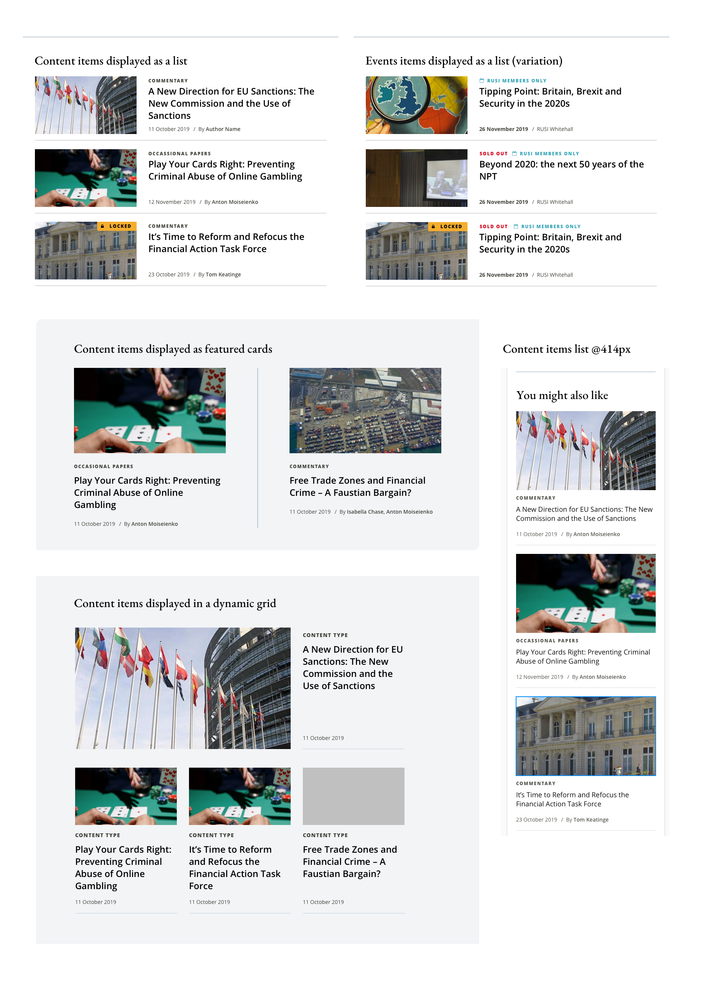

# Creating re-usable Components by standing on the shoulders of giants

This is conceptually a part 2 to [Week 01 of CSS-in-JS](./css-in-js-week01.md),
which looks at a conceptually coherent way of using CSS and CSS-in-JS.

The mental model examining boundaries and the costs of crossing them highlights
that there are **boundaries within our applications**, and being clear about
these boundaries can help make decisions about their structure and consequently
make components much more reusable. This lesson is around indicating these
boundaries with examples and then extrapolating some ways of working with them
instead of against them.

## The problem

The problem we are trying to examine is how to reason about application
structure and make decisions that help to create UI Components that we can
re-use in multiple situations, while at the same time not making them so
abstract that they are hard to use.

I'd like to use a real world situation to give us a way into this quite nuanced
problem and I'm going to try approach this without the benefit of experience and
just take it step by step. Hopefully by the end of this, we will have exercised
the mental models and have a few simple rules of thumb that will allow us to
shortcut most or all of these steps.

## First designs

These are some designs that we have been given:


They show a couple of variants of a Card "content item displayed as a list". The
"event" items on the right seem to have an icon and a possible "Sold Out" in the
"taxonomy" area, but are otherwise very similar apart from some content and
weighting differences in the card "meta-data" area.

Spend a little time thinking about how you would build the UI and styling that
caters for these 2 use cases...

### First go at making the UI

As we've discussed elsewhere [the week 1 React course](./week01.md), the first
step in making a Component is just making it without too much concern about
optimizing or re-usability:

```js
// ContentCard.jsx
import React from "react";
import styles from "./ContentCard.module.css";

export const ContentCard = ({
    uri,
    imageSrc,
    imageAlt,
    heading,
    taxonomy,
    published,
    citation,
}) => {
    return (
        <article className={styles.component}>
            <a href={uri} className={styles.link}>
                <figure className={styles.imageWrap}>
                    
                </figure>
                <div className={styles.contentWrap}>
                    <header className={styles.header}>
                        <p className={styles.taxonomy}>{taxonomy}</p>
                        <h3>{heading}</h3>
                    </header>
                    <p className={styles.info}>
                        <span className={styles.published}>{published}</span> /{" "}
                        <span className={styles.citation}>{citation}</span>
                    </p>
                </div>
            </a>
        </article>
    );
};
```

There are lots of things wrong with this (admittedly naïve) first try at the
Component, but sometimes it is the right thing to start simple and make
mistakes. That said it also has some "good" ideas such as the image makes sure
that there is an `alt` attribute; the nice, semantic use of `<article>`; etc...
Basically an okay start.

Applying the boundary mental model;

1. everything is within the one Component
2. and styles are in their own file (though you might use a different CSS-in-JS
   solution).
3. The component controls its interface
4. and layout and style.
5. Content comes from a wrapping context - we're going to assume there is
6. an external API for data somewhere.

We are going to assume that we have a theme setup (7) as described in part 1. I
am not going to make the full stylesheet here so as to keep things simple, so
there will be incomplete implementations of the design.

```css
/** ContentCard.module.css **/

.component {
    /* This is actually an object famously described by OOCSS, so this component can map to that perfectly */
    position: relative;
    padding: calc(var(--s-1) * 1.5) 0;
    border-bottom: 1px solid var(--c-gray-500);
}

.link {
    display: flex;
    justify-content: flex-start;
    align-items: flex-start;
    color: var(--c-body);
    text-decoration: none;
}

.imageWrap {
    width: 10.625rem;
    height: 6rem;
}

.contentWrap {
    flex: 1;
    align-self: stretch;
    margin-left: var(--s-2);
    display: grid;
    grid-template-columns: 1fr;
    grid-template-rows: max-content 1fr max-content;
}

.image {
    width: 100%;
    max-height: 100%;
    object-fit: cover;
}

.metaText {
    font-family: var(--font-family-1);
    font-size: var(--t-body-xs);
}

.taxonomy {
    margin: 0 0 var(--s-1);
    text-transform: uppercase;
    font-weight: var(--tw-bold);
    composes: metaText;
}

.heading {
    font-size: var(--t-body-m);
    font-family: var(--font-family-2);
    font-weight: var(--tw-m);
    line-height: 1.3em;
    margin-bottom: 0;
}

.info {
    align-self: flex-end;
    composes: metaText;
    margin-bottom: 0;
}
```

This results in:


Ignoring the fine details, this includes the specifics of the layout and spacing
and the bottom border on each content card, along with placeholder fonts...

## Making cards reusable by understanding their boundaries

### The school of hard knocks

We are happily implementing these cards in the lists when we get get the rest of
the designs for the card:



These new designs show that these cards display in some very different ways; we
have at least 2 new layouts and multiple variations of spacing and borders.
Nevertheless, they also have recurring elements and themes.

Take a little time to consider how you might approach these new requirements.

The most common thing (which I've done a thousand times) would be to just start
adding variations; adding styles or JS logic to cater for all of these new
requirements. To illustrate this path, let's look at the code changes that we
need to make for the simplest scenario, the small screen layout.

So, how does it currently adapt in size?


First reaction - Oh well! Easy fix! Just add some rules allow it to wrap in
flex - we aren't even going to need a media query!

```css
/* ContentCard.module.css */

.link {
    display: flex;
    /* Just allow wrapping in the link */
    flex-flow: row wrap;
    justify-content: flex-start;
    align-items: flex-start;
    ...;
}

.contentWrap {
    flex: 1;
    align-self: stretch;
    margin-left: var(--s-2);
    display: grid;
    grid-template-columns: 1fr;
    grid-template-rows: max-content 1fr max-content;
    /* and add a min-width here... */
    min-width: 170px;
}
```

Which results in...


Not quite. How are we going to take that margin off the left of the content and
put spacing around the image? Maybe we do need a media query after all? And when
we get this layout done, how are we going to get those other layouts similar to
this but on larger screens? Etc...

### Learning a lesson in boundaries

Hopefully it also shows that just piling on more code to cover all the options
will just become messy quickly.

So what is a better approach? Iff we know where the boundaries are, we know
where responsibility lies and from that we can shape our code.

For the purposes of this example, there are 3 types of boundary:

1. A layout context
2. A UI element
3. A UI element's contents

Which all seems quite abstract, so let's look at what that actually means.

#### Layout contexts

These are essentially the different layouts, with the important distinction that
the layouts are caused by something outside of the card itself - the card
doesn't have any information that lays it out differently.

1. "Horizontal" - as they appear in our first designs - when there is enough
   space, the card will "flow" to a horizontal layout.
2. "Vertical" - as they appear in constrained space, the card wraps.
3. "Hero" - the larger, emphasized card layout - this gives precedence to the
   image, but the flow is quite similar to the "horizontal" layout... and one
   expects from these designs that the behaviour is the same as the others on
   smaller screens.
4. Vertical list
5. Horizontal list
6. Hero list

Notice that there are 2 distinct types of layout context, the layout of the
card's elements and the way the cards are laid out?

#### UI Elements

We have already done this work, when we made our first example though we may not
have been conscious of it. This is a good time to also consider conceptual,
design, hierarchical and semantic boundaries that abound (sorry) in this part of
an application. Each of these boundaries serves a function, such as
accessibility, look and feel, etc. Sometimes these boundaries are at odds with
each other, such as when a design shows a tiny page title, or where there is a
conceptual boundary that is not semantic. Some boundaries, however, such as
hierarchy and semantics cooperate to the point of being reciprocal. It is good
to be clear about **which of these is most important to your use case**.

1.  The wrapping element - an `<article>` makes a good, semantic option
2.  A link - an `<a>` anchor element is the semantic tag for hyperlinking
3.  An image - we chose to semantically wrap the image in a `<figure>`, which
    gives us a new, conceptual boundary:
4.  An area concerned with media
5.  To which we could add another concept, an area concerned with textual
    content; in our case a `<div>`
6.  Taxonomy - we chose a simple, semantic text element, `<p>`
7.  Article heading - the heading hierarchy in HTML is well defined and
    important for screen reader users, who can use them to navigate the page. It
    is very hard to make a re-usable component that has a defined heading in,
    but we had a stab at guessing the hierarchy with `<h3>`
8.  In all the designs, there is a hierarchical boundary between the heading
    plus taxonomy and the meta text below - in HTML there is the structural
    element `<header>` for this.
9.  The meta information - this is one of the areas of the design that changes
    the most. Earlier we chose to use a `<p>` to identify this area, but
    actually, as the text doesn't really form a coherent sentence or paragraph,
    it would probably be better to just use a semantically neutral `<div>`
10. Variously we have a published date (`<time>`), an author (`<span>`) and a
    location (`<address>`)

As an aside [schema.org](https://schema.org/Article) has some further data that
we can add to this to make it more consumable by search engines...

Now that we have clear boundaries, 10 UI and 6 layout contexts, it is easier to
see why piling on more code just gets messy!

### Assigning responsibility

Once we are clear of the boundaries, it is time to examine the responsibilities
and how they relate. As there are so many combinations here, we'll have to limit
this a bit to some exemplary ones so that the concepts can be extrapolated.

#### Dealing out the cards :spades: :hearts: :diamonds: :clubs:

As an example, there are apparently 3 ways that cards can relate to each other
in a layout; vertical lists, horizontal lists and hero lists (which is like a
horizontal list with a twist). Each of these layouts starts off as a vertical
list in constrained space.

The question is where does the responsibility lie for declaring how the cards
will layout - with the cards or with their wrapping element?

_I think that it is not hard to see that a card cannot layout other cards, so it
makes sense for **the parent to take responsibility for laying out the cards**_.

That then begs the question, what about spacing between the cards (CSS grid
notwithstanding)? Many people would likely put a margin right and bottom on the
cards and then do whatever they needed to do to then swallow that margin for the
ends of rows, etc... But, if we examine the other layouts, we'll see that they
all have different spacing around the cards... how would a card "know" what the
spacing around it should be?

In fact, when we consider this problem from the point of view of the boundary,
_it is hard to to see why the cards should be responsible for this when we
already know that the parent is responsible for layout_, of which this is an
integral part.

Once we move this spacing to our layout context, the cards become more re-usable
immediately because they can be used as is in all our layout contexts without
any changes!

So we can make a couple of statements about layout:

1. The layout context is responsible for the laying out of its content
2. The white space in the layout context is part of that responsibility - or to
   put it another way; never put whitespace in your component styles!

### Them's the cards :diamonds:

Now let us look at the layouts of the card's content; to understand the layout,
we also need to look at the UI elements and the content that sits in them.

It is probably stating the obvious to say that a component is responsible for
its own styles (indeed that is entire reason for all the CSS-in-JS libraries out
there). So it makes sense that the component lays itself out, and this agrees
with statements above... or does it?

We can understand something about the responsibilities here if we examine what
part of our application "knows" what?

The designs show us that some areas of the the cards change a lot, seemingly
arbitrarily - or more specifically, seemingly depending on context or data type.
To put it another way, the card can only inspect the (changeable) taxonomy
content once it receives the data, but the element that prepares the data to
pass to the card is aware of the "shape" of the data before it passes it to the
card. The same is true of the locked status and the other changeable factors.
This schema knowledge is a type of boundary and boundaries indicate
responsibility.

Equally, "arbitrary" layout requirements - e.g. the "hero" component - the
wrapping component is treating its first child element differently. Again, this
means that the wrapping component "knows" something (perhaps about the data, or
something else) that is opaque to the card.

All of this would seems indicate that the wrapping elements need be, at least
partially, responsible for helping the card respond to these variants...

From these examples we can extrapolate one rule that allows us to reason about
application structure:

    Knowledge of something like data schema or layout intent is a boundary and boundaries represent responsibilities

### It's all about the shuffle

The nature of the Component UI architecture is its reasonable boundaries; each
Component is a boundary and it is responsible for its content. i.e. it provides
a context for its content. The aim is to keep each Component as simple as
possible (like the View in MVC). Nevertheless this leaves us with a problem
where something in our application has to "know" about data, something has to
"know" about layout, etc. This gave rise to the pattern in React of having
"wrapping" components that have logic and compose other, more simple
Components - this is similar (but different) to the View-Controller in the MVVC
pattern. I call these knowledgeable Components, Edge Components because they are
like mini-applications in themselves and often can have some data fetching.

A common way to allow a wrapping Component to help the card is to add more and
more props for everything that can change in the layout. Even our first attempt
at the component had 7 props, and we could add `type`, `locked`, `layout`, etc
props and it would work... but it would be almost impossible to use and won't
scale if some other designs come in or the component is used in another project.
This way is the same as piling on more code to make it work.

Alternatively, if we accept that components should be permeable/ should accept
some types of help we can implement a very simple type of inversion of control
pattern. In React we are given essentially 2 key APIs to our Components, the
properties we can pass the Component and the children we can markup in a
Component. There are 2 more, but I want to keep this simple. Our inversion of
control pattern basically creates a gateway in each of these APIs for our Laying
out Component to influence its child components.

1. Components implement a `className` prop to create a simple "inversion of
   control" for styles (and optionally implement a prop destructuring pattern
   for passing arbitrary, uncontrolled props).
2. Components implement a "well behaved children" pattern or a "strictly well
   behaved children" pattern

"Well behaved children" is a term I've coined to describe the pattern of
providing expected child Components for a main Component. The "Edge" component
then creates the contents of your Component out of your expected child
Components. This allows your Edge component to order content, set classes on the
children (if necessary), choose what to display amongst other things while the
main Component will still have style and structural say over them.

This is what our ContentCard Component might look like using this pattern

```js
// ContentCard.jsx
import React from "react";
import cx from "classnames";
import styles from "./Card.module.scss";

// Well beahved child components are exported from the same file

// Every Component, even the "well behaved" children implement this `className` prop...
export const CardImage = ({ className, uri, alt, ...rest }) => {
    return (
        {/* ...and insert it on the base element */}
        <figure className={cx(className, styles.imageWrap)}>
            
        </figure>
    );
};

export const CardTitle = ({ children, ...rest }) => <>{children}</>;
export const CardTaxonomy = ({ className, children, ...rest }) => (
    <p className={cx(className, styles.taxonomy)}>{children}</p>
);
export const CardMeta = ({ className, children, ...rest }) => (
    <div className={cx(className, styles.info)}>{children}</div>
);

const TextContent = ({ children }) => (
    <div className={styles.contentWrap}>{children}</div>
);

export const Card = ({ className, uri, children, ...rest }) => {
    return (
        <article className={cx(className, styles.component)} {...rest}>
            <a href={uri} className={styles.link}>
                {children}
            </a>
        </article>
    );
};
```

```javascript
// NewList.jsx (Edge Component)
import React from "react";
import cx from "classnames";
import gql from "graphql-tag";
import { useQuery } from "@apollo/react-hooks";
import { Card, CardImage, CardTaxonomy, CardTitle, CardMeta } from "./Card";
import { NewsMetaData } from "./NewsMetaData";

import styles from "./NewsList.module.scss";

const NEWS_QUERY = gql`
    {
        listNewsItems {
            results {
                title
                taxonomy
                status
                pageLink
                publishedDate
                primaryImage {
                    imagePath
                    imageDescription
                }
                author {
                    id
                    name
                }
            }
        }
    }
`;
export const NewsList = ({ className, ...rest }) => {
    const { data, loading, error } = useQuery(NEWS_QUERY);
    const outPutNews = React.useCallback(
        (newsItems) =>
            newsItems.map((newsItem, index) => (
                <li key={`news-${index}`}>
                    {/* We can use our style prop to suggest to the Card how much spacing it should use, or pass it a theme */}
                    <Card className={styles.card} uri={newsItem.pageLink}>
                        <CardImage
                            className={styles.cardImage}
                            uri={newsItem.primaryImage.imagePath}
                            alt={newsItem.primaryImage.imageDescription}
                        />
                        {/* NOTE: The wrapping boundary that represents both the media and the text content 
                            is not the responsibility of the outer layout context */}
                        <CardTaxonomy>
                            {/* We can put what ever structure of content we want into the taxonomy */}
                            <span className={styles.warning}>Sold out</span>
                            <span>Commentary</span>
                        </CardTaxonomy>
                        {/* We get to set the heading level... */}
                        <CardTitle>
                            <h3 className={styles.heading}>{newsItem.title}</h3>
                        </CardTitle>
                        {/* By looking at responsibility, we can see that the meta is only a layout; the 
                            content is defined by the knowledge of the data */}
                        <CardMeta>
                            <NewsMetaData
                                publishedDate={newsItem.publishedDate}
                                author={newsItem.author}
                            />
                        </CardMeta>
                    </Card>
                </li>
            )),
        []
    );

    // assume checks for loading and error etc here
    return (
        <>
            {data && data.listNewsItems.results.length ? (
                <ul className={cx(className, styles.edge)} {...rest}>
                    {outPutNews(data.listNewsItems.results)}
                </ul>
            ) : (
                <p>Shockingly, there is no news right now!</p>
            )}
        </>
    );
};
```

This is a really nice way to allow responsibility to permeate where it needs to.
We get a lot of control over style, layout and content... but sometimes it is
not enough. The above code that uses the WBC pattern ends up with this output:

```html
<article class="_card_d1bb0 _component_41e77">
    <a href="/news/124" class="_link_41e77"
        ><figure class="_imageWrap_41e77">
            
        </figure>
        <p class="_taxonomy_41e77 _metaText_41e77">
            <span class="_warning_d1bb0">Sold out</span><span>Commentary</span>
        </p>
        <h3>A shorter heading</h3>
        <div class="_info_41e77 _metaText_41e77">
            <time datetime="2020-04-04T21:36:32.429Z">4 April 2020</time>
            <span> / By <strong>Elmore Leonard</strong></span>
        </div></a
    >
</article>
```

We've lost out on our `<header>` and we've lost out on our conceptual boundary
for text content versus media. There are a number of ways to deal with this, but
the important thing is that we don't try to foist the responsibility for them
onto the Edge Component; the responsibility for these lies squarely with the
Card itself.

This is where the SWBC (Strictly Well Behaved Children) pattern can help -
though I don't recommend using it if you can help it! SWBC asks the Card to
check in on its children and make sure they are behaving as expected:

```javascript
// New component is only used within Card and doesn't need exporting
const TextContent = ({ children }) => (
    <div className={styles.contentWrap}>{children}</div>
);

export const Card = ({ className, uri, children, ...rest }) => {
    // Loop through the children and ensure that they are properly wrapped, etc
    const wrapChildren = React.useCallback(() => {
        const headerContent = [];
        const textContent = [];
        const otherContent = [];

        React.Children.map(children, (child) => {
            if (
                child.type.name === "CardTaxonomy" ||
                child.type.name === "CardTitle"
            ) {
                return headerContent.push(child);
            }
            if (child.type.name === "CardMeta") {
                return textContent.push(child);
            }

            return otherContent.push(child);
        });

        return [
            ...otherContent,
            <TextContent key="textContent">
                <header className={styles.heading}>{headerContent}</header>
                {textContent}
            </TextContent>,
        ];
    }, [children]);

    return (
        <article className={cx(className, styles.component)} {...rest}>
            <a href={uri} className={styles.link}>
                {wrapChildren()}
            </a>
        </article>
    );
};
```

Now we have our expected HTML

```html
<article class="_card_d1bb0 _component_41e77">
    <a href="/news/124" class="_link_41e77"
        ><figure class="_imageWrap_41e77">
            
        </figure>
        <div class="_contentWrap_41e77">
            <header class="_heading_41e77">
                <p class="_taxonomy_41e77 _metaText_41e77">
                    <span class="_warning_d1bb0">Sold out</span
                    ><span>Commentary</span>
                </p>
                <h3>A shorter heading</h3>
            </header>
            <div class="_info_41e77 _metaText_41e77">
                <time datetime="2020-04-04T21:36:32.429Z">4 April 2020</time>
                <span> / By <strong>Elmore Leonard</strong></span>
            </div>
        </div></a
    >
</article>
```

## The Ace up the sleeve :clubs:

To elegantly set a number of style parameters at the same time, we can use the
theming technique described in part 1. The really nice thing about it is that
the theme is scoped in synergy with the layout context, nevertheless we should
be mindful of the boundaries of what we want to do so that we don't make the
mistake of just piling on code in a different way. The layout context should
only try to control the things for which it is responsible.

```scss
.edge {
    composes: noList from "../../../styles/utilities.module.css";
    /* you could use grid here or make a theme variable for card spacing */
}
.card {
    border-bottom: 1px solid var(--c-gray-300);
    /* variables are scoped to the edge component, mobile first so we can add the layout context spacing for our cards */
    --media-spacing: 0 0 8px;
    --media-width: 100%;
    --media-height: auto;
    --card-flow: row wrap;
    --card-justify: flex-start;
    --card-align: flex-start;
}

.warning {
    color: var(--c-red);
    margin-right: 1em;
}

@media (min-width: 375px) {
    .card {
        --media-spacing: 0 16px 0 0;
        --media-width: 10.625rem;
        --card-flow: row nowrap;
        --card-justify: flex-start;
        --card-align: flex-start;
    }
}
```

and then we just need to implement the theme in our card styles

```scss
...

.link {
    display: flex;
    // we can use our them to control card layout
    flex-flow: var(--card-flow);
    justify-content: var(--card-justify);
    align-items: var(--card-align);
    color: var(--card-color);
    text-decoration: none;
}

.imageWrap {
    // and media, etc
    width: var(--media-width);
    height: var(--media-height);
    margin: var(--media-spacing);
}

.contentWrap {
    flex: 1;
    align-self: stretch;
    display: grid;
    grid-template-columns: 1fr;
    grid-template-rows: max-content 1fr max-content;
}

.image {
    ...
}

.metaText {
    ...
}

...

```

Now, each layout and data context can choose which content, how it is displayed
and how it is laid out and the ContentCard never changes... it is truly
re-usable.

## Summary

By understanding that "knowledge" is a boundary and boundaries equate to
responsibility, which always flows downward (in React at least), we can reason
about what should be handled where in our application. And because each part of
our application is doing only the things that it is responsible for, the pieces
are more re-useable.

## Further reading

https://kentcdodds.com/blog/the-state-reducer-pattern-with-react-hooks
